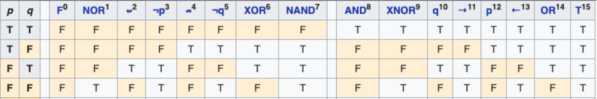
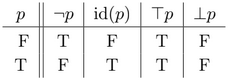

To start talking about anything we need a collection of **symbols** (a **formal-alphabet**). Any possible combination of *symbols* of the *formal-alphabet* is a **formula**. Generally there are some combinations that are not allowed. In this case, a collection of **formation-rules** (a **formal-grammar**) indicate which *formulas* are allowed (or **well-formed**) and which are not. The collection of all the *well-formed-formulas* (*wffs*) is known as a **formal-language** (note that it's completely defined by the *formal-alphabet* and the *formal-grammar*).

> Example: The *symbols* $a,b,c$ define the *formal-alphabet* $\mathcal A= \{a,b,c\}$. Any combination of these *symbols* is a *formula*, f.e. $b, ac, cbccca, abcabcabc, cc,$ etc. We can then use a *formal-grammar* $\mathcal G$ formed by e.g. 3 *formation-rules* $\mathcal G= \{$"Valid formulas have 3 symbols", "After a $b$ can't be an $a$", "After a $c$ must be other $c$"$\}$. With $\mathcal A$ setting the possible *formulas*, and $\mathcal G$ establishing which *formulas* are *well-formed* and which are not (e.g. $aab$ and $bcc$ are *wffs*, and $aca, aaaa, cba$ are not) we have completely defined the _formal-language_ $\mathcal L$. The _formal-language_ $\mathcal L$ (defined by ($\mathcal A, \mathcal G$)) consists then explicitely of the *wffs* ${aaa, aab, aac, abb, abc, acc, bbb, bbc, bcc, ccc}$.We can then either write the implicit definition of $\mathcal L$ as $\mathcal L=(\mathcal A, \mathcal G)$ or explicitely define it as the collection of *wffs* $\mathcal L={aaa, aab, aac, abb, abc, acc, bbb, bbc, bcc, ccc}$.

# propositions

A **proposition** is a statement that has a definite **truth-value**, either **True** (T) or **False** (F). Historically we denote *propositions* in general with lowercase letters starting from $p$, i.e. $p,q,r,s,\dots$, etc. 

> Examples: The statements "4 is even" ($p$) and "Rome is the capital of Italy" ($q$) are *propositions* with *truth-value* *True*, while "5 is even" ($r$) is a *proposition* with *truth-value* *False*.

## logical-connectives

Say we have two *propositions* $p$ and $q$ (each, as we saw, with two possible *truth-values* T or F), we can combine them to form a new *proposition* in 16 different ways. We'll use a *symbol* to denote each case, and call them **logical-connectives** (or just **connectives**). 

> Note: The *logical-connectives* 11, 13, 2, and 4 in the table are called **implication**, **converse-implication**, **non-implication**, and **converse-non-implication** respectively.

The new *propositions* created using *connectives* (like $r=p$XOR$q$ or $s=p$NOR$q$) are called **compound-propositions** in contrast to the starting ones ($p$ and $q$ in this case) that are called **atomic-propositions**.

> Example: We can combine the *propositions* of the previous example with for example the **XNOR** *connective* to obtain a new *proposition* that is *True* only when they have the same *truth-value*. In this case $p\text{XNOR}q$ read as "4 is even XNOR Rome is the capital of Italy" is a True *proposition* since both *atomic-propositions* are *True* (have *truth-value* *True*), and $p\text{XNOR}r$ read "4 is even XNOR 5 is even" is a *False* *proposition* since $p$ is *True* and $r$ is *False*. 

> Example: We can also combine the *propositions* of the previous example with for example the **AND** *connective* to obtain a new *proposition* that is *True* only when both *atomic-propositions* are *True*. In this case $p\text{AND}q$ read as "4 is even AND Rome is the capital of Italy" is a True *proposition* since both *atomic-propositions* are *True* (have *truth-value* *True*), and $p\text{AND}r$ read "4 is even AND 5 is even" is a *False* *proposition* since $p$ is *True* and $r$ is *False*. Continuing with this trend, we have that $p\text{NAND}q$ is a *False* *proposition*, $p\text{NAND}r$ is *True*, $q\text{NAND}r$ is *True*, $p\text{OR}q$ is *True*, $p\text{OR}r$ is *True*, $r\text{OR}q$ is *True*, $pFq$ is *False*, $rFq$ is *False*, $rFp$ is *False*, etc.

 The 16 *logical-connectives* of the previous table let us create 16 new *compound-propositions* from 2 previous *atomic-propositions*, but a *logical-connective* can create a new *compound-proposition* from only one *atomic-proposition* $p$. The four possible combinations are: let the *truth-values* of $p$ untouched, which is known as the **identity-connective**, invert them, which is known as the **negation** connective ($\neg$), make them always *True*, known as the **tautology** connective ($\top$) and make them always *False*, known as the **contradiction** connective ($\bot$).

We can also have *logical-connectives* that create a new *proposition* given 3, 4, and any number $n$ of previous *propositions*. To specify this number we call the 4 *connectives* that act over just one *proposition* **unary-logical-connectives**, the 16 that act over two *propositions*, **binary-logical-connectives**, and in general, the $2^{2^n}$ that act over $n$ *propositions*, **n-ary-logical-connectives**. We call $n$ the **arity** of the *logical-connective*.
## functional-completeness

The number of *connectives* grows extremely fast with the *arity* (there are $2^{2^2}=2^4=16$ *binary-logical-connectives*, $2^{2^3}=2^8=256$ *3-ary-logical-connectives*, $2^{2^4}=2^{16}=65536$ *4-ary-logical-connectives*, $2^{2^5}=2^{32}=4294967296$ *5-ary-logical-connectives*, etc.), but luckily, the great majority of these *connectives* are redundant (they can be constructed using other *connectives*) so we can use a much smaller number of them. For example we can see in the table of the *binary-connectives* that the values are mirrored, i.e. the 8 *connectives* of the left are just the negation of the 8 on the right. Therefore, we can construct the 16 possible *binary-connectives* with just 8 and the *unary-connective* of *negation* ($\neg$). Furthermore, we can note that the *negation* is the *NOR* *connective* applied to the same *proposition* ($\neg p=p$NOR$p$), so we don't need the *negation* anymore, we can construct the 16 *binary-connectives* using just the 8 of the left. The excellent news is that we can continue this search to find that we can construct any *connective* (of any *arity*!!) using only just one *binary-connective*! (namely the *NOR* or the *NAND* *connectives*). This property is known as **NAND completeness** (or **NOR completeness**). 

We can construct any *logical-connective* using only the *NAND connective*, and we can construct the it using the *negation* of *AND* $(p\text{NAND}q=\neg(p\text{AND}q))$, therefore we can construct any *connective* from these two. The same is true for the *negation* and *OR connectives* (since we can construct the *NOR connective* as the *negation* of *OR*). Any collection of *connectives* that allow us to create all of the others from them (like the *NAND* and *NOR* *connectives*, or the collections $\{\neg, OR\}$ and $\{\neg, AND\}$ as we just said) is called **functional-complete**. The *functional-complete* collections (of *logical-connectives*) (**FCCs**) that do not contain redundant *connectives* and are called **minimal-funcional-complete**. For example the collections $\{\neg, \text{AND}, \text{XNOR}\}$ and $\{\neg, \text{AND}, \text{OR}\}$ are *functional-complete* but not *minimal* since we can construct the $\text{XNOR}$ and $\text{OR}$ *connectives* using the other two. The collections $\{\text{NAND}\}, \{\text{NOR}\}, \{\neg, \text{AND}\}, \{\neg, \text{OR}\}$ are all examples of *minimal-funcional-complete* collections of *connectives*.

> Although we saw that all the *connectives* can be constructed using just one *connective* (NAND or NOR), for readability in general we use *FCCs* of more than one *connective*. E.g. it's better to read $p$OR$q$ than $(p$NOR$q)$NOR$(p$NOR$q)$, and it is better to read $p$AND$q$ than $(p$NOR$p)$NOR$(q$NOR$q)$, etc.

# propositional-formal-language

As we have been doing, in general, to represent *atomic-propositions* we use lowercase letters $\{p,q,r,s,t,\dots\}$, and from then, with an *FCC* (e.g. $\{\neg, \text{AND}\}$) and parentheses to indicate the order of application of the *connectives*, we can create any *proposition*, so they form a *formal-alphabet* where the *propositions* are *formulas* (these are known as **propositional-formal-alphabets**). But not all the *formulas* of a *propositional-formal-alphabet* $\mathcal A$ (in our example $\mathcal A = \{\neg, \text{AND},(,),p,q,r,s,\dots\}$) are *propositions*, e.g. $p((\neg$ or $\neg pq(r$ are just nonsensical combinations of *symbols* of $\mathcal A$. With a *formal-grammar* $\mathcal G$ that identifies as *well-formed-formulas* just the *formulas* that are indeed valid *propositions* we have that all the *propositions* form a *formal-language* known (very creatively) as **propositional-formal-language**. The *formal-grammar* $\mathcal G$ used to convert a *propositional-formal-alphabet* into a *propositional-formal-language* is known as a **propositional-formal-grammar**, and the most commonly used consist of just two *formation-rules*:
1. If $p$ is an *atomic-proposition* (e.g., $p, q, r, \dots$), then $p$ is a *wff*.
2. If $\phi$ and $\psi$ are *wffs*, then $(\neg \phi)$ and $(\phi \text{AND} \psi)$ are *wffs*, and similarly for other *connectives* in the *FCC*, with parentheses enclosing each application.

> Examples of *wffs* of the *propositional-formal-language* with *FCC* $\{\neg, OR, AND\}$ are $p$, $\neg q$, $pORq$, $\neg(pORq)$, $(pORq)ANDs$, $(pORq)AND(sAND(qOR(\neg p)))$, etc. And examples of *formulas* that are not *wffs* are $pp$, $ORq$, $(pAND)q$, $q($, $(pOR)AND\neg p$, $((p)ORq$, $p((\neg$, $\neg pq(r$, etc.

> Notation note: The *logical-connectives* *AND* and *OR* are often represented with the *symbols* $\land$ and $\lor$ respectively. E.g. the *proposition* $(pORq)ANDs$ is written as $(p\lor q)\land s$, the *proposition* $\neg(pORq)$ written $\neg(p\lor q)$, etc.
 
## equivalent-propositions

A *proposition* can have the exact same *truth-values* than other, f.e. $p$ and its double *negation* $\neg (\neg p)$, or $pNORq$ and the *negation* of $pORq$ (check the table of *binary-logical-connectives*). In that cases we talk about **equivalent-propositions** and denote them using $\iff$. For example, we can say that $p$ and $\neg(\neg p)$ are *equivalent-propositions*, or directly write $p\iff \neg(\neg p)$. The same for $pNORq \iff \neg(pORq)$. It is common sometimes to replace one for the other for the sake of readability, comparison, brevity, etc. There exist two pairs of *equivalent-propositions* that, given their importance and widespread use, receive a name (**Morgan's laws**) and that are $\neg(p\lor q) \iff (\neg p) \land (\neg q)$ and $\neg(p\land q) \iff (\neg p)\lor (\neg q)$ (the *negation* of *OR* is the *AND* of the *negations* and vice versa). The equivalences of the *truth-values* are shown in the next tables.

| $p$ | $q$ | $p\lor q$ | $\neg(p\lor q)$ | $\neg p$ | $\neg q$ | $(\neg p) \land (\neg q)$ |
| :-: | :-: | :-------: | :-------------: | :------: | :------: | :-----------------------: |
|  T  |  T  |     T     |        F        |    F     |    F     |             F             |
|  T  |  F  |     T     |        F        |    F     |    T     |             F             |
|  F  |  T  |     T     |        F        |    T     |    F     |             F             |
|  F  |  F  |     F     |        T        |    T     |    T     |             T             |

| $p$ | $q$ | $p\land q$ | $\neg(p\land q)$ | $\neg p$ | $\neg q$ | $(\neg p)\lor (\neg q)$ |
| :-: | :-: | :--------: | :--------------: | :------: | :------: | :---------------------: |
|  T  |  T  |     T      |        F         |    F     |    F     |            F            |
|  T  |  F  |     F      |        T         |    F     |    T     |            T            |
|  F  |  T  |     F      |        T         |    T     |    F     |            T            |
|  F  |  F  |     F      |        T         |    T     |    T     |            T            |

Another pair of *equivalent-propositions* that is important (enough to receive a name) is $p \rightarrow q \iff (\neg q) \rightarrow (\neg p)$, and is known as the **contrapositive-law**. For this reason, the *proposition* $(\neg q) \rightarrow (\neg p)$ is known as the **contrapositive** of the *implication* $p \rightarrow q$. Again the equivalences of the *truth-values* are shown in the next table.

| $p$ | $q$ | $p \rightarrow q$ | $\neg q$ | $\neg p$ | $(\neg q) \rightarrow (\neg p)$ |
| :-: | :-: | :---------------: | :------: | :------: | :-----------------------------: |
|  T  |  T  |         T         |    F     |    F     |                T                |
|  T  |  F  |         F         |    T     |    F     |                F                |
|  F  |  T  |         T         |    F     |    T     |                T                |
|  F  |  F  |         T         |    T     |    T     |                T                |

A final important equivalence is $p XNOR q \iff (p\to q)AND(q \to p)$. For this reason, the logical-connective XNOR is also called the **biconditional** and represented with the *symbol* $\leftrightarrow$ (i.e. instead of $p XNOR q$ we often write $p\leftrightarrow q$).

| $p$ | $q$ | $p \rightarrow q$ | $q \to  p$ | $(p\to q)AND(q \to p)$ | $p XNOR q$ |
| :-: | :-: | :---------------: | :--------: | :--------------------: | :--------: |
|  T  |  T  |         T         |     T      |           T            |     T      |
|  T  |  F  |         F         |     T      |           F            |     F      |
|  F  |  T  |         T         |     F      |           F            |     F      |
|  F  |  F  |         T         |     T      |           T            |     T      |

## order-of-precedence

To reduce the use of parentheses, it is common to define an **order-of-precedence** for the _logical-connectives_ of the *FCC*. That is, define an order in which they have to be applied if different *connectives* appear in a *proposition* without parentheses. For example, a very common _order-of-precedence_ of *connectives*, is: *negation* $\neg$, *AND* $\land$, *OR* $\lor$, *implication* $\to$, and then *biconditional* (or *XOR*) $\leftrightarrow$. With this order, the *proposition* $p \land q \to r$ is interpreted as $(p \land q) \to r$, because _conjunction_ ($\land$) has higher precedence than _implication_ ($\to$). Similarly, $\neg p \lor q$ is interpreted as $(\neg p) \lor q$, since _negation_ ($\neg$) has higher precedence than _disjunction_ ($\lor$). In contrast, $p \to q \land r$ is interpreted as $p \to (q \land r)$, and $\neg p \leftrightarrow q \to r$ is interpreted as $(\neg p) \leftrightarrow (q \to r)$.

# predicates

A **predicate** is a statement containing **variables**, which becomes a *proposition* when all the *variables* are given a specific value. Historically we denote *variables* with lowercase letters starting from $x$, i.e. $x,y,z,a,b\dots$, etc. and *predicates* with uppercase letters starting from $P$. The number of *variables* in a *predicate* is called its **arity**.

> Example: The statement "$x$ is even" is not a *proposition*, as its *truth-value* depends on the value of $x$, but it is a *predicate* (that we can denote $P(x)$) that if the value of $x$ is, for example, 2 it becomes the *proposition* $p=P(2)$ ("2 is even") with *truth-value* *True*, and if the value of $x$ is, for example, 3 it becomes the *proposition* $q=P(3)$ ("3 is even") with *truth-value* *False*. 

> Example: Similarly, the **binary-predicate** (a *predicate* of two *variables*) $Q(x,y)=$"$x$ is the capital of $y$" becomes a *proposition* when both $x$ and $y$ are specified, e.g., $p=Q($Rome,Spain) ("Rome is the capital of Spain") is *False* and $q=Q($Paris,France) is *True*.
 
If for the *binary-predicate* of the previous examples we specify the value of just one of the *variables* we end up not with a *proposition*, but with a **unary-predicate** (a *predicate* of just one *variable*). 

> For example, if for the previous *predicate* $Q(x,y)$ we specify the value of $y=$"Spain", then $Q(x$,"Spain") becomes the *unary-predicate* $R(x)=$"$x$ is the capital of Spain" that f.e. is a *True* *proposition* for $R($Madrid)=$Q$(Madrid,Spain). Similarly, if we specify the value of $y=$"Spain", then $Q($Lima,$y$) becomes the *unary-predicate* $S(y)=$"Lima is the capital of $y$" that f.e. is a *False* *proposition* for $S($Canada)=$Q$(Lima,Canada) and a *True* *proposition* for $S($Peru)=$Q$(Lima,Peru). 

In general, if we have a *predicate* of $m$ *variables*, and we specify the value of only $n$, it becomes a new *predicate* of $m-n$ *variables*, and when we specify all the $m$ *variables* it becomes a *proposition*. So a *proposition* is a *predicate* of $m-m=0$ *variables* in this context.

> For example, the *predicate* $P(x,y,z)=$"$x$ is a city of $z$ AND $y$ is a city of $z$" is a 3-ary *predicate* that if we specify f.e. $z=$"Italy" becomes the *binary-predicate* "$x$ is a city of Italy AND $y$ is a city of Italy", and if we specify the value of also $x$ and $y$ with f.e. $x=$"Lima" and $y=$"Madrid", then it becomes the *proposition* (or 0-ary *predicate*) "Lima is a city of Italy AND Madrid is a city of Italy".

*Predicates* can be combined using *logical-connectives,* just as *propositions* are, to form new *predicates* (called **compound-predicates**) since when all the *variables* of the new *compound-predicate* are specified, the *predicates* that were combined (called **atomic-predicates**) have also all their *values* specified and become *propositions*. Then the resulting *truth-value* is determined just applying the *logical-connectives* to this *propositions*.

> Example: The *predicates* $P(x)=$"$x$ is even" and $Q(y,z)=$"$y$ is greater than $z$" can be combined using f.e., the *logical-connective* *AND* to form the *compound-predicate* $R(x,y,z)=$"$x$ is even AND $y$ is greater than $z$" that just as any other *predicate* becomes a *proposition* when all of its *variables* are specified. F.e., $R(4,8,3)$ becomes the *True* *proposition* "4 is even AND 8 is greater than 3", and f.e., $R(6,4,9)$ becomes the *False* *proposition* "6 is even AND 4 is greater than 9".

## existential-quantifier

There is another way to convert a *predicate* into a *proposition* besides specifying the value of all its *variables*. It is the statement "there exists (at least one) value of $x$ that makes $P(x)$ a *True* *proposition*". To represent this sentence we use the symbols $\exists xP(x)$ where we have added the symbol $\exists$ known as the **existential-quantifier**.

> Examples: For the *predicate* $P(x)=$"$x$ is even" without the need to specify a singular value for $x$ we know that the *proposition* $\exists xP(x)$ (read as "there exists (at least one) value of $x$ that makes "$x$ is even" a *True* *proposition*") is a *True* *proposition* since f.e. $P(2)$ is *True*, and in the same way we also know that for the *predicate* $Q(y)=$"Rio de Janeiro is the capital of the country $y$" the proposition $\exists yQ(y)$ is a *False* *proposition* since there is no value for $y$ that makes $Q(y)$ *True*.

# predicative-formal-language

You can note that since *predicates* can be combined using *logical-connectives* (just as *propositions* are) to form new *predicates*, and that *predicates* of *0-arity* represent *propositions*, then the *formal-language* of *predicates* (known as **predicative-formal-language**) is a generalization of the *propositional-formal-language* that adds to it the power to talk about *variables* and [existence](#existential-quantifier). 

A *formal-alphabet* that lets us write any *predicate* (known as a **predicative-formal-alphabet**), is, as you can guess, formed by the *symbols* used to form *predicates* (uppercase letter starting from $P$, and lowercase letters starting from $x$ and parenthesis and commas to list the *variables*), to combine them (an *FCC* of *logical-connectives*), and to talk about existence (the *existential-quantifier* $\exists$). An example of a *predicative-formal-alphabet* is $\mathcal A = \{\neg, \text{AND},\exists,(,,,),P,x,Q,y,R,z,S,\dots\}$ (compare with the example of a [*propositional-formal-alphabet*](#propositional-formal-language)). 

Just as we saw in the [propositional-formal-language](#propositional-formal-language)) case, every *predicate* is a *formula* of a *predicative-formal-alphabet*, but not every *formula* of a *predicative-formal-alphabet* is a *predicate*, since a lot of them are nonsensical combinations of *symbols* of the *formal-alphabet*. To differentiate them, we need a *formal-grammar*. The *formal-grammar* $\mathcal G$ used to convert a *predicative-formal-alphabet* into a *predicative-formal-language*, is known as a **predicative-formal-grammar**, and the most commonly used consist of just the next three *formation-rules*:
1. If $P$ is a *predicate* *symbol* of *arity* $n$, and $x, y, \ldots, w$ are $n$ *variable* *symbols*, then $P(x, y, \ldots, w)$ is a *wff*. 
2. If $\phi$ and $\psi$ are *wffs*, then $(\neg \phi)$ and $(\phi \text{AND} \psi)$ are *wffs*, and similarly for other *connectives* in the *FCC*, with parentheses enclosing each application. 
3. If $\phi$ is a *wff* and $x$ is a *variable* *symbol*, then $\exists x \phi$ is a *wff*.

> The *propositional-formal-language* is a very elemental *formal-language* and it lacks the power to express ideas more complex than true or false statements. As we've said, the *predicative-formal-language* is a generalization that adds to it the power to talk about *variables* and [existence](#existential-quantifier). This seemingly simple addition might not seem to represent a big change, but incredibly, it ends up providing the *formal-language* with (as we'll see a little later) the power to express all the mathematics known to the moment!!

## additional-quantifiers

For a *predicate* $P(x)$ that could be f.e. "Milan is the capital of the country $x$", we saw that $\exists xP(x)$ is a *proposition* (*False* in this case). We can apply the *negation* *connective* $\neg$ to make it a *True* *proposition*, i.e. $\neg(\exists xP(x))$ is a *True* *proposition* read as "there exists no value of $x$ that makes $P(x)$ a *True* *proposition*". To represent this more concisely we use the symbol $\nexists$ (known as the **non-existential-quantifier**) to write $\neg(\exists xP(x))$ directly as $\nexists x P(x)$.

We can also use the *existential-quantifier* to the *negation* of the *predicate*, i.e. $\exists x \neg(P(x))$ read as "there exists (at least one) value of $x$ that makes $\neg(P(x))$ a *True* *proposition*" or equivalently, "there exists (at least one) value of $x$ that makes $P(x)$ a *False* *proposition*". Note that if use the *non-existential-quantifier* to the *negation* of the *predicate*, i.e. $\nexists \neg(P(x))$, we are stating that "there exists no value of $x$ that makes $P(x)$ a *False* *proposition*", and this is equivalently to the statement "every value of $x$ makes $P(x)$ a *True* *proposition*". We can represent this last statement with the *symbols* $\forall x P(x)$ (making use of the new *symbol* $\forall$, known as the **universal-quantifier**).

The *existential-quantifier* in f.e. $\exists x P(x)$ states that "there exists (at least one) value of $x$ that makes $P(x)$ a *True* *proposition*", but sometimes it is useful to clarify that "there exists exactly one value of $x$ that makes $P(x)$ a *True* *proposition*". This latter *proposition* is represented with the *symbol* $!\exists$ (known as the **existence-and-uniqueness-quantifier**) to write $!\exists x P(x)$. This _proposition_ is _True_ if there is one and only one value of the *variable* $x$ for which $P(x)$ is _True_, and _False_ otherwise.

> Example: For the _predicate_ $P(x)=$"$x$ is the capital of Spain", the _proposition_ $!\exists x P(x)$ is _True_ because there is exactly one value of $x$, namely $x=$"Madrid", that makes $P(x)$ _True_. In contrast, for the _predicate_ $Q(x)=$"$x$ is even", the _proposition_ $!\exists x Q(x)$ is _False_ because there are multiple values of $x$ (f.e. 2, 4, 6) that make $Q(x)$ _True_. Similarly, for the _predicate_ $R(x)=$"Rio de Janeiro is the capital of the country $x$", $!\exists x R(x)$ is _False_ because no value of $x$ makes $R(x)$ _True_.

## redundancy-of-quantifiers

The _existence-and-uniqueness-quantifier_ can be expressed using the _existential-quantifier_ and _logical-connectives_. Specifically, $!\exists x P(x)$ is equivalent to $\exists x (P(x) \text{AND} \nexists y (P(y) \text{AND} \neg (y \text{XNOR} x)))$, which states that there exists an $x$ for which $P(x)$ is _True_ and there does not exist a different $y$ for which $P(y)$ is _True_. This shows that $!\exists$, like $\nexists$ and $\forall$, is not strictly necessary for the _predicative-formal-language_, as all three can be written using $\exists$ and the _functional-complete_ collection (*FCC*) of _logical-connectives_. However, including $\nexists$, $\forall$, and $!\exists$ in the _predicative-formal-alphabet_ is convenient because they shorten formulas and make *propositions* more intuitive. Note that if we include the _quantifiers_ $\nexists$, $\forall$, and $!\exists$ in the _predicative-formal-alphabet_ $\mathcal{A}$ (f.e., $\mathcal{A} = \{\neg, \text{AND}, \exists, \nexists, \forall, !\exists, (,), ,, P, x, Q, y, R, z, S, \dots\}$), we must update the _predicative-formal-grammar_ $\mathcal{G}$ to account for them. The third _formation-rule_ then becomes:
3. If $\phi$ is a _wff_ and $x$ is a _variable_ *symbol*, then $\exists x \phi$, $\nexists x \phi$, $\forall x \phi$, and $!\exists x \phi$ are _wffs_.

> Note that the _predicative-formal-language_ remains fully expressive with only $\exists$ in the _alphabet_, but adding these _quantifiers_ enhances readability and compactness. This is analogous to defining a *propositional-formal-language* with an *FCC* of *logical-connectives* that is not *minimal* (i.e. that contains redundant *connectives* that enhance readability and compactness).

## partial-quantification

When applying _quantifiers_ to **multivariate-predicates** (_predicates_ of more than one _variable_), we can quantify some but not all _variables_. If we apply a _quantifier_ to fewer than all _variables_, the result is not a _proposition_ but a _predicate_ with fewer _variables_. For example, consider the _predicate_ $P(x, y)=$"$x$ is greater than $y$". Applying the _existential-quantifier_ to $x$, we write $\exists x P(x, y)$, which becomes the _unary-predicate_ $Q(y)=$"there exists an $x$ that is greater than $y$". This _predicate_ is _True_ f.e. for $y=5$ (since $6 > 5$) but _False_ for $y=$"the largest number" (if such a concept is defined).

> Example: For the _binary-predicate_ $Q(x, y)=$"$x$ is the capital of $y$", the _proposition_ $\exists x Q(x, y)$ is the _unary-predicate_ $R(y)=$"there exists an $x$ that is the capital of $y$", which is _True_ f.e. for $y=$"France" (since $Q($Paris, France$)$ is _True_) but _False_ for $y=$"Antarctica" (since no $x$ makes $Q(x, \text{Antarctica})$ _True_). Similarly, $\forall y Q(x, y)$ is the _unary-predicate_ $S(x)=$"for all $y$, $x$ is the capital of $y$", which is _False_ for any $x$ since no single $x$ is the capital of all countries.

## multiple-variables-quantifiers

When multiple _quantifiers_ are applied consecutively to different _variables_ of a _predicate_, we can collapse the notation for brevity. For example, the _proposition_ $\exists x \exists y \exists z P(x, y, z)$, read as "there exists an $x$, a $y$, and a $z$ such that $P(x, y, z)$ is _True_", can be written more concisely as $\exists x, y, z P(x, y, z)$. Similarly, $\forall x \forall y P(x, y)$ can be written as $\forall x, y P(x, y)$. This collapsed notation is a shorthand that assumes the _quantifiers_ apply to each _variable_ in sequence but does not change the meaning of the _proposition_ or _predicate_.

> Example: For the _predicate_ $P(x, y, z)=$"$x$ is a city of $z$ AND $y$ is a city of $z$", the _proposition_ $\exists x \exists y \exists z P(x, y, z)$ can be written as $\exists x, y, z P(x, y, z)$, meaning "there exist $x$, $y$, and $z$ such that $x$ and $y$ are cities of $z$". This is _True_ f.e. for $x=$"Rome", $y=$"Milan", and $z=$"Italy". Similarly, $\forall x, y Q(x, y)$ for $Q(x, y)=$"$x$ is greater than $y$" means "for all $x$ and $y$, $x$ is greater than $y$", which is _False_ since not all $x, y$ satisfy $x > y$.

> Note: You may have noticed that the _predicative-formal-grammar_ does not have a rule for the application of e.g. $\exists x, y, z$. The collapsed notation $\exists x, y, z P(x, y, z)$ is a shorthand for $\exists x \exists y \exists z P(x, y, z)$, permitted in the _predicative-formal-grammar_ only as a notational convenience, provided the _quantifiers_ are applied sequentially to distinct _variables_ (i.e., $\exists x, y, z$ is just a notational tool that replaces the formal $\exists x \exists y \exists z$).
