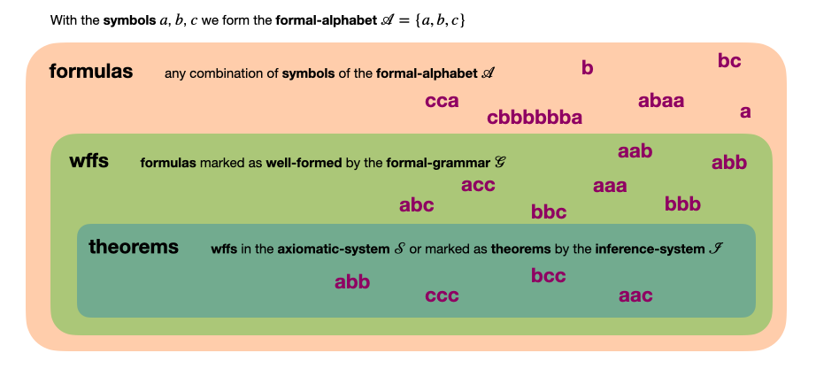

We saw in the [previous entry](m1-formal-language), that a collection of *formation-rules* (the *formal-grammar*) indicate which *formulas* are *well-formed* and form a *formal-language*. Now we will go a step further by marking some of the *wffs* of a given *formal-language* $\mathcal L$ as **theorems**. This is done again by a collection of rules, known as **inference-rules**. The collection of *inference-rules* that we decide to use is known as an **inference-system**. Unlike a *formal-grammar*, an *inference-system* requires a starting point. This is, it marks *wffs* as *theorems* using previous *theorems* (action that is known as "to **infer** a theorem"). To avoid this recursion, a collection of *wffs* (known as **axiomatic-system**) is chosen to be arbitrarily marked as *theorems* in order to start the process. Each of the *wffs* of the *axiomatic-system* is called an **axiom**. All *wffs* that can be marked as *theorems* depend on the *formal-language* ($\mathcal L$), the *inference-system* ($\mathcal I$), and the *axiomatic-system* ($\mathcal S$). The *formal-language* ($\mathcal L$) defines all the *wffs* that can be marked as *theorems*, the *inference-system* ($\mathcal I$) specifies the rules for marking them, and the *axiomatic-system* ($\mathcal S$) provides the initial *theorems* to begin the process. This triplet is then very important as a whole and that is why it receives a name, i.e. a **formal-system** ($\mathcal F=(\mathcal L, \mathcal I, \mathcal S)$). Once we choose a *formal-system* $(\mathcal F)$, the collection of *wffs* of $\mathcal L$ that will be *theorems* is automatically defined. This collection is known as the **theory**.

In the [previous entry](m1-formal-language), we saw that the *formal-language* $\mathcal L$ is formed by all the *formulas* that can be created as combinations of *symbols* of the *formal-alphabet* $\mathcal A$, and are marked as *well-formed-formulas* (*wffs*) by the *formation-rules* of the *formal-grammar*. In the image above, the *formal-language* $\mathcal L$ (defined by $(\mathcal A, \mathcal G)$) is formed by all the *formulas* (in purple) that are inside the green area, i.e. all the *formulas* that are marked as *well-formed* using the *formal-grammar* $\mathcal G$ (all the *wffs*) are the 10 *formulas* $aaa, aab, aac, abb, abc, acc, bbb, bbc, bcc, ccc$ (check the example in [m1-formal-language](m1-formal-language)). Then we if we choose an *axiomatic-system* $\mathcal S$ (i.e. we chose some of these *wffs* (e.g. $abb$ and $ccc$) to be marked as *theorems*), and an *inference-system* $\mathcal I$, we have defined the *formal-system* $\mathcal F=(\mathcal L, \mathcal I, \mathcal S)$. All the *wffs* that can also be marked as *theorems* using this *formal-system* $\mathcal F$ (i.e. all the *wffs* that can also be marked as *theorems* by the *inference-rules* of $\mathcal I$ starting from the *axioms* $abb$ and $ccc$ of $\mathcal S$) form the *theory* $\mathcal T$. In the image above, we suppose that all the *wffs* that can be marked as *theorems* starting from $\mathcal S=\{abb,ccc\}$ and using $\mathcal I$ are $bcc$ and $aac$, so the *theory* $\mathcal T$ defined by the *formal-system* $\mathcal F=(\mathcal L, \mathcal I, \mathcal S)$ is formed by the four *theorems* $\{abb, ccc, bcc, aac\}$ (the blue area of the image).

> Notation note: It is common when talking about *formal-systems* to refer to the action of marking a *wff* as a *theorem* $t$ following $\mathcal I$ and $\mathcal A$, as to **prove** the *theorem* $t$. So we often hear of a *theory* as "the collection of all the *wffs* that can be *proven* from the *formal-system* $\mathcal F$". 

# zeroth-order-formal-system

Any *formal-system* $\mathcal F=(\mathcal L, \mathcal I, \mathcal S)$ that uses as its *formal-language* $\mathcal L$ the *propositional-formal-language* is called a **zeroth-order-formal-system**. As we saw, in a *formal-language* a *wff* is a *proposition*. In a *zeroth-order-formal-system* a *theorem* will be a *True* *proposition*, and to *prove* a *theorem* will be to *infer* that it is *True*.

## inference-rules

A *zeroth-order-formal-system* deals with *propositions*, and their *truth-values*, then the things to be inferred will be *truth-values* of *propositions*. For example, suppose we are told that the *proposition* $p AND q$ is a *theorem* (i.e. a *True* *proposition*). If we look at the [definition](m1-formal-language#logical-connectives), the only combination of *truth-values* of $p$ and $q$ for which it is *True* is both $p=T$ and $q=T$, so, if we are told that $p AND q$ is *theorem*, then we know that both $p$ and $q$ are *theorems* too (*True* *propositions*). This is an **inference**. We are told that $p AND q$ is a *theorem* (i.e. that is True), and nothing about the *truth-values* of the *propositions* $p$ and $q$, but this information is implicit in the *logical-connective* definition itself. This is, this information is not directly given to us, we are just told that $pANDq$ is a *theorem*, but we can "*infer*" that they are *theorems* too since the only combination of *truth-values* of $p$ and $q$ for which $pANDq$ is *True* is when both $p$ and $q$ are *True*. 
![[truth-values-and.png]]
If we are told that a given collection of *propositions* $\mathcal P$ (known as **premises**) are *theorems*, and if for all cases for which these *propositions* are *True*, some *proposition* $p$ (called the **conclusion**) is also *True*, we say that we can *infer* from $\mathcal P$ (being *theorems*) that $p$ is also *True*. This is nothing more than what we have called an *inference-rule* and is symbolically represented as $\mathcal P \models p$. For the case of $pANDq$ this rule is called **simplification** and is represented as $pANDq \models p$. Note that we can also use *simplification* to *infer* $q$, i.e., $pANDq \models q$. Conversely, (and as an example of an *inference-rule* of more than one *premise*) we can be told that the two *propositions* $p$ and $q$ are *premises* (therefore *theorems*, therefore both *True*) and from that *infer* that $pANDq$ is *True* (note that again that for the only row where both $p=T$ and $q=T$, we have $pANDq=T$). This *inference-rule* represented as $p,q\models pANDq$ is called **conjunction**.

Note, however, that not from every *theorem* (or collection of them) we can *infer* something. For example, $pORq\models p$ is not an *inference-rule*, since if we are told that $pORq$ is a theorem, we have three possible combinations of values of $p$ and $q$ that makes it True, and in two $p$ is True, but in the other $p$ is False. If from a rule $\mathcal P \models p$ we can actually infer the *conclusion* $p$, we say that the rule **valid**, if not (as in the case of $pORq\models p$) we called it a **fallacy**. 
![[valid-inference-rule.png]]
However, if we add the the premise $\neg q$, the only combination where both are True is $q=F$ and $p=T$ so we then can actually infer $p$ as a theorem. Then $pORq\models p$ is a fallacy, but $p OR q,\neg p \models q$ is an inference-rule, called **disjunctive-syllogism**. Note that we can also use the *disjunctive-syllogism* to infer $p$ by adding $\neg q$ as a premise (i.e. $p OR q,\neg q \models p$).

Other very commonly used inference-rule in a *zeroth-order-formal-system* is $p\to q, p \models q$, known as **modus-ponens**. We can again, looking at the definitions, that for all cases for which the premises are True (just one in this case), $q$ is True. 
![[modus-ponens 1.png]]
Suppose we are given $p\to q$ and $\neg q$ as premises. Using the *contrapositive-law* $p \rightarrow q \iff (\neg q) \rightarrow (\neg p)$ (that we introduce in the [previous-entry](m1-formal-language#equivalent-propositions)) we have that $\neg q \to \neg p$ is a theorem. And from it and $\neg q$ we can infer $\neg p$ using modus-ponens ($\neg q \to \neg p, \neg q \models \neg p$). This inference-rule, represented as $p\to q, \neg q \models \neg p$, is called **modus-tollens** and is a variance of the modus-ponens using the contrapositive-law.

> Note: Since if we are given two premises $p$,$q$ we can infer (using *conjunction*) that $pANDq$ is a theorem, and conversely, if we are given $pANDq$ as a single premise we can infer (via simplification) $p,q$ as two different premises. For this reason, in the collection of premises, $p,q$ or $pANDq$ are used interchangeably to state that both $p$ and $q$ are premises. For example, in some texts you can find the *disjunctive-syllogism* rule written as $(p OR q)AND(\neg p) \models q$, the *modus-ponens* rule written as $(p\to q)AND p \models q$, the *modus-tollens* rule as $(p\to q)AND \neg q \models \neg p$, etc.

As a final example, and as an example of an inference-rule with three different atomic-propositions we'll present the case of the inference-rule $p\to q, q\to r\models p\to r$ known as **hypothetical-syllogism**. Again, if you look in the next table, you'll see that for all cases for which both $p\to q$ and $q\to r$ are True, the proposition $p\to r$ is also True. Therefore, from the propositions $p\to q$ and $q\to r$ we can actually infer $p\to r$, making the *hypothetical-syllogism* a *valid* inference-rule.

![[hypothetical-syllogism.png]]
### fallacies

As we saw, a rule from which we cannot actually infer the conclusion is called a fallacy. F.e., we saw that, unlike the *disjunctive-syllogism* $p OR q,\neg p \models q$ that is a *valid* *inference-rule*, the rule $p OR q \models q$ is a fallacy since there are cases of which $pORq$ is True that $q$ is False. Many fallacies receive a name, f.e. $p OR q \models q$ is called the **affirming-a-disjunct-fallacy**. Unlike the *modus-ponens* ($p\to q,p \models q$), the rule $p\to q,q \models p$ is a *fallacy* (called the **affirming-the-consequent-fallacy**), since (as you can check in the following table) when $p\to q$ and $q$ are both True, $p$ could be False. 

![[fallacy.png]]

Other example of a common *fallacy* is $p\to q, \neg p \models \neg q$, known as the **denying-the-antecedent-fallacy**. Note that $p \to q$ is *True* when $\neg p$ is *True* (i.e., $p$ is *False*) for both values of $q$ (and therefore both values of $\neg q$).
## examples

We saw that a *zeroth-order-formal-system* a *formal-system* $\mathcal F=(\mathcal L, \mathcal I, \mathcal S)$ that uses the *propositional-formal-language* as its *formal-language* $\mathcal L$. Thus, the different types of *zeroth-order formal systems* are defined by  different combinations of *inference-system* (*$\mathcal I$*) and *axiomatic-system* (*$\mathcal S$*). Now that we’ve explored some common [*inference-rules*](#inference-rules) of a *zeroth-order formal system*, let’s examine a few concrete examples to illustrate how these systems are constructed and applied.

### axiomatic-formal-systems

The first type of of *zeroth-order-formal-system* we'll talk about is known as [axiomatic](https://en.wikipedia.org/wiki/Propositional_calculus#Syntactic_proof_via_axioms) since they all have an *inference-system* that contains just one *inference-rule* (the *modus-ponen*s i.e. $p \to q, p \models q$), and therefore, their power comes from the intelligent choice of *axioms* for the *axiomatic-system*. The first system of this kind was formally described by Gottlob Fredge in his 1879 book called "Begriffsschrift" (for what is called **Frege-axiomatic-system**) and had the following six *axioms*:
- Axiom 1: $p \rightarrow(q \rightarrow p)$
- Axiom 2: $(p \rightarrow(q \rightarrow r)) \rightarrow((p \rightarrow q) \rightarrow(p \rightarrow r))$
- Axiom 3: $(p \rightarrow(q \rightarrow r)) \rightarrow(q \rightarrow(p \rightarrow r))$
- Axiom 4: $(p \rightarrow q) \rightarrow(\neg q \rightarrow \neg p)$
- Axiom 5: $\neg \neg p \rightarrow p$
- Axiom 6: $p \rightarrow \neg \neg p$

Jan Łukasiewicz showed in 1930 that, in *Frege-system*, "the third *axiom* can be derived from the preceding two, and that the last three *axioms* can be replaced by the single one $(\neg p \rightarrow \neg q) \rightarrow(p \rightarrow q)$, reducing the number of *axioms* to just three, in the system known as **Łukasiewicz-axiomatic-system** :
- Axiom 1: $p \rightarrow(q \rightarrow p)$
- Axiom 2: $(p \rightarrow(q \rightarrow r)) \rightarrow((p \rightarrow q) \rightarrow(p \rightarrow r))$
- Axiom 3: $(\neg p \rightarrow \neg q) \rightarrow(q \rightarrow p)$

Finally, and to end a search of many years, in 1953, Carew Meredith showed that the number of axioms can be incredibly reduced to just one, obviously known as the [**Meredith-axiom**](https://us.metamath.org/mpeuni/meredith.html).
* Axiom: $((((p \to q) \to(\neg r \to \neg s)) \to r) \to t) \to((t \to p) \to(s \to p))$
This axiom, allows to have a *zeroth-order-formal-system* (called the **Meredith-axiomatic-system**) that not only has an inference-system of a single inference-rule (the *modus-ponens*), but also an axiomatic-system of a single axiom (the *Meredith-axiom*).

### inference-formal-system

The other type of *zeroth-order-formal-systems* are known as **inference-formal-systems** (or *formal-systems* based on *inference*) since they take a different approach by eliminating *axioms* entirely and instead, relying purely on a rich *inference-system*. The best known consists of 11 inference-rules designed to mimic the natural reasoning processes of mathematicians. They are *modus-ponens*, *disjunctive-syllogism*, *conjunction*, and 8 more listed and explained [here](https://en.wikipedia.org/wiki/Propositional_calculus#Inference_rules). By starting without *axioms* and building *proofs* step-by-step using these rules, this system provides a flexible framework for constructing proofs that feels more intuitive. This approach contrasts with the axiomatic-formal-systems, emphasizing process over initial assumptions.

# first-order-formal-system

Any *formal-system* $\mathcal F=(\mathcal L, \mathcal I, \mathcal S)$ that uses as its *formal-language* $\mathcal L$ the *predicative-formal-language* is called a **first-order-formal-system**.

## inference-rules

**universal-instantation**
