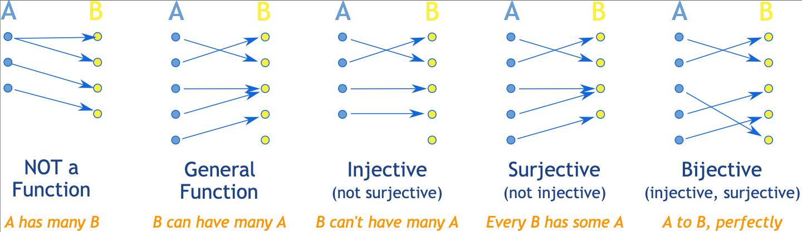

A **set-formal-system** is a *formal-system* that extends a *first-order-formal-system* with a particular collection of *axioms*. This collection of *axioms* (that are added to the *axiomatic-system* of the *first-order-formal-system*) is known as a **set-axiomatic-system**. Any *variable* in a *set-formal-system* is called a **set**, and is a formalization of the natural concept of collection. 

> Notation note: In the context of *set-axiomatic-systems*, a *binary-predicate* $R(x,y)$ is historically referred to as a **relation**, and denoted $xRy$ instead of $R(x,y)$ in what is known as the **infix-notation**. 

The **set-membership-relation** $\in(x,y)$ is a *relation* (*binary-predicate*) that is completely defined by the *set-axiomatic-system*. The *relation* (in *infix-notation*) $x \in y$ is read as "the *set* $y$ **contains** the *set* $x$", or "the *set* $x$ is an **element** (or **member**) of the *set* $y$". Given a *set* $x$, in general, we list all its *elements* (i.e. all the *sets* $y$ that satisfy $y \in x$) between brackets, e.g., we write the *set* of vowels as $x:=\{a,e,i,o,u\}$. A *set* that *contains* just one *element* is called a **singleton** (e.g. $\{a\}$), a *set* that *contains* two *elements* is called a **pair** (e.g. $\{a,b\}$), and a *set* that *contains* three *elements* a **triplet** (e.g. $\{a,b,c\}$). The number of *elements* in a *set* is known as its **cardinality**. So we can say for example, that a *singleton* has *cardinality* 1, a *pair* *cardinality* 2, and a *triplet* *cardinality* 3, the *set* of vowels $x$ cardinality 5, etc.

The _set-membership relation_ $\in$, let us define four other useful *relations*:
* $x \notin y:\Leftrightarrow \neg (x\in y)$ called the **not-member-relation** and read as "the *set* $y$ does **not contain** the *set* $x$", or "the *set* $x$ is **not an element** of the *set* $y$"
* $x \subseteq y :\Leftrightarrow \forall z(z \in x \rightarrow z \in y)$ called the **subset-relation** and read as "all the *elements* of $x$ are *elements* of $y$" or simply "the *set* $x$ is a **subset** of the *set* $y$"
* $x \subset y:\Leftrightarrow (x\subseteq y) \wedge \neg(y \subseteq x)$ (or equivalently $\subset (x,y) :\Leftrightarrow (x\subseteq y) \wedge \neg(x=y)$) called the **proper-subset-relation** and read as "the *set* $x$ is a **proper-subset** of the *set* $y$"
* $x=y :\Leftrightarrow (x \subseteq y) \wedge(y \subseteq x)$ called the **equal-relation** and read as "the *set* $x$ is a **equal** of the *set* $y$"

Before talking about *set-axiomatic-systems* we will introduce one last type of *relation* that is fundamental in all of mathematics and for which we will dedicate its own section.

# maps

A **map** (or **function**) is a *relation* $\phi$ between the *elements* of two *sets* $A,B$ that satisfies $\forall a \in A: \ \exists! b \in B: \phi(a, b)$. Since $b$ is unique we can write $b=\phi(a)$. The *elements* $a,b$ are known as **input** and **output** respectively, and the *sets* $A,B$ are known as the **domain** and **codomain** of $\phi$ respectively. Given a *subset* $V\subseteq B$, the *set* of all the *inputs* whose *output* is in $V$, i.e. $\{a \in A \mid \phi(a) \in V\}$ is called the **preimage of $V$ under $\phi$** and denoted $\text{preim}_\phi(V)$. Note that $\text{preim}_\phi(V) \subseteq A$. Given a *subset* $U\subseteq A$, the *set* of all the *outputs* we obtain by applying $\phi$ to $U$, i.e. $\{b\in B \mid \exists a\in U: \phi(a)=b\}$ is called the **image of $U$** **under** $\phi$ and denoted $\text{im}_\phi(U)$. If the *subset* is directly the whole *domain* is called just the **image of $\phi$** and denoted $\text{im}_\phi:=\text{im}_\phi(A) =\{b\in B \mid \exists a\in A: \phi(a)=b\}$. Note that the *image* of any *subset* $U\subseteq A$ is a *subset* of the *codomain* $B$. If the image of $\phi$ is the whole codomain $\text{im}_\phi(A)=B$, i.e. every $b\in B$ is an *output* of some $a\in A$, we say that the map $\phi$ is **surjective**. If there are no two different *outputs* with the same *input* (i.e. $\forall a_{1}, a_{2} \in A: \phi\left(a_{1}\right)=\phi\left(a_{2}\right) \Rightarrow a_{1}=a_{2}$) we say that the *map* $\phi$ is **injective**. Note that if $\phi$ is *surjective* and *injective*, then every *element* of the *codomain* is the *output* of a unique *element* of the *domain*, i.e. $\forall b \in B ,\exists! a \in A:b=\phi(a)$, in this case $\phi$ is a one-to-one mapping of the *domain* and the *codomain* and we say that $\phi$ is **bijective**. In some cases, instead of saying that the *map* $\phi$ is *injective*, *surjective* or *bijective*, we say that $\phi$ is an **injection**, a **surjection**, or a **bijection**. A *bijection* from a *set* $A$ to itself is a **permutation**. The more standard example of a *permutation* is the **identity-map**, that maps every *element* $a\in A$ to itself, i.e. $\text{id}_{A}:  A \rightarrow A \mid  \ a \mapsto a$. The *set* of all the *bijection*s from a *set* $A$ to itself (*permutations*) receives the name of the **symmetric-set** of $A$ and is denoted as $\Phi_A$. If there exists a *bijection* between to any pair of *sets* $A$ and $B$, we say that they are **isomorphic-sets**, denoted $A \cong_{\text{set}} B$. Given 2 *maps* $\phi:A \to B$ and $\psi: B \to C$, the *map* $\psi \circ \phi: A  \rightarrow C \mid a  \mapsto \psi(\phi(a))$ read as "$\psi$ after $\phi$" is known as the **composition** of $\phi$ and $\psi$. We saw that a *bijection* $\phi$ is a one-to-one mapping of the *domain* and the *codomain*, having each $b\in B$ a unique corresponding $a\in A$ s.t. $\phi(a)=b$. We could then have a *map* that returns for each $b\in B$ that unique $a\in A$, such *map* is known as the **inverse-map** of $\phi$, denoted $\phi^{-1}$ and is completely defined by $\phi^{-1} \circ \phi = \text{id}_A \  \wedge \ \phi \circ \phi^{-1} = \text{id}_B$ (where $\circ$ is *composition* and $\text{id}_X$ the *identity-map*). If a *map* has a *inverse-map*, we say that it is **invertible**. A *permutation* $\phi:A \to A$ that is its own *inverse-map* is known as an **involution**.

# zfc-set-formal-system

The search for whether there exists a *set-axiomatic-system* capable of deriving all currently known mathematics has been long and fascinating. This quest led to the formulation of a *set-axiomatic-system* consisting of 9 *axioms*, known collectively as **ZFC**. Below, we will present these 9 *axioms*—first in plain English, and then in *predicative-formal-language*. (Recall that these *axioms* are added to a *first-order-formal-system*, and are therefore formally expressed in a *predicative-formal-language*.)

([listed here](https://en.wikipedia.org/wiki/Zermelo%E2%80%93Fraenkel_set_theory))

## axiom-of-extensionality

> Informal version: Two *sets* with the same *elements* are the same *set*.

> Formal version: $\forall x,y(\forall z(z \in x \leftrightarrow z \in y) \rightarrow x=y)$

### ordered-sets

We have seen that the _elements_ of a _set_ are specified within brackets. The _set_ of vowels $x$, which we previously wrote as $\{a,e,i,o,u\}$ in alphabetical order, could also be written as $\{i,a,u,e,o\}$—and it would still be the same _set_, since it _contains_ the same _elements_ (the same holds for any other order we might choose to list the vowels). This is why it is generally said that _sets_ have no intrinsic order: any order in which we list their _elements_ corresponds to the same _set_. However, it is often useful to refer to the _elements_ of a _set_ in a specific order. For this purpose, we define the notion of an **ordered-set** (or **tuple**) as follows. We'll start with the example of a _pair_, since a _singleton_ only has one possible order. Given a _set_ $y$ with two _elements_ $a$ and $b$ (a _pair_), both $\{a,b\}$ and $\{b,a\}$ refer to the same _set_ $y$. But using the same _elements_, we can define the _ordered-set_ $(a,b):=\{\{a\}, \{a,b\}\}$ or the _ordered-set_ $(b,a):=\{\{b\}, \{a,b\}\}$. Note that $\{a,b\}=\{b,a\}=y$, but $(a,b) \neq (b,a)$ because they do not have the same _elements_: the first _contains_ $\{a\}$, while the second _contains_ $\{b\}$ instead. In the same way, from a _set_ of three _elements_ (a _triplet_) $\{b,c,a\}$, we can define the _ordered-set_ $(a, b, c):=\{\{a\},\{\{b\},\{b, c\}\}\}=\{\{a\},(b,c)\}$, or the *ordered-set* $(c, b, a):=\{\{c\},\{\{b\},\{b, a\}\}\}=\{\{c\},(b,a)\}$, etc. An _ordered-set_ of four _elements_ could, for example, be defined as $(c, d, b, a):=\{\{c\},\{\{d\},\{\{b\},\{a, b\}\}\}\}=\{\{c\},(d,b,a)\}\}$, and by continuing in this way, one can define an _ordered-set_ of any _cardinality_. An _ordered-set_ of 2 _elements_ is called an **ordered-pair** (or a **2-tuple**), and an _ordered-set_ of 3 _elements_ is called a **triple** (or a **3-tuple**).

## axiom-of-pairing

> Informal version: Given two *sets* $x$ and $y$, then the *pair* $\{x,y\}$ is also a *set*.

> Formal version: $\forall x,y( \exists z \forall w:((w=x \vee w=y) \rightarrow w \in z))$

## axiom-of-union

> Informal version: Given a *set* $x$, the *union-set* $\bigcup x$ is a *set*.
## axiom-of-replacement

> Informal version: The *image* of a *set* under any *map* is a *set*.

https://us.metamath.org/mpeuni/mmtheorems53.html#mm5279b

## axiom-of-regularity

> Informal version: Every *non-empty* *set* *contains* a *set* *disjoint* from itself.

One consequence is that it denies the existence of a set containing itself
## summary

Axiom-of-extensionality (E): Two *sets* with the same *elements* are the same *set*.
Axiom-of-pairing (P): Given the *sets* $a$ and $b$, then the *pair* $\{a,b\}$ is a *set*.
Axiom-of-replacement (R): 	The *image* of a *set* under any *map* is a *set*. (scheme)
Axiom-of-union (U): Given a *set* $x$, the *union-set* $\bigcup x$ is a *set*.
Axiom-of-regularity (G): Every *non-empty* *set* *contains* a *set* *disjoint* from itself.
Axiom-of-separation (S): (scheme)
Axiom-of-power-set (W):
Axiom-of-infinity (I):
Axiom-of-choice (C): 

[TOC of Theorem List - Metamath Proof Explorer](https://us.metamath.org/mpeuni/mmtheorems.html#dtl:2)

Este sistema consiste de 9 *axioms* , pero ha quedado de esta manera for clarity and ease of use ya que se ha [mostrado](https://us.metamath.org/mpeuni/mmtheorems27.html#mm2698h) con el tiempo que varios de los mismos son redundantes. 

# useful-definitions

#todo definir antes tal vez estas cosas

**cartesian product**
**disjoint**. (se usa en Axiom-of-regularity)
**union-of-sets**

Given a *set* $X$, a **partition** $P(X)$ is a collection of *non-empty*, and pairwise *disjoint* *subsets* $A_i\subseteq X$
whose *union* is the whole *set*, i.e. $\bigcup_i A_i =X$.
# relations

A **reflexive** *relation* satisfy $\forall x:xRx$ (i.e. $\forall x:R(x,x)$), an **irreflexive** if $\forall x:\neg (xRx)$, a **symmetric** $\forall x,y:xRy \Leftrightarrow yRx$, an **asymmetric** $\forall x,y:xRy \Rightarrow \neg (yRx)$, an **antisymmetric** $\forall x,y: xRy \wedge yRx \Rightarrow x=y$, a **total** $\forall x,y: xRy \vee yRx$, a **transitive** $\forall x,y,z: xRy \wedge yRz \Rightarrow xRz$, and finally, an **antitransitive** $\forall x,y,z: xRy \wedge yRz \Rightarrow \neg(xRz)$. 
A *transitive* *relation* is called a **preorder** (R) if it's *reflexive*, and a **strict-preorder** (I) if it's *irreflexive*. A *total* *preorder* is called a **total-preorder** (RT), and a *symmetric* *preorder* an **equivalence** (RS).  An *antisymmetric* *total-preorder* is a **total-order** (RTA), an *antisymmetric* *equivalence* is an **equality** (RSA), and an *antisymmetric* *preorder* is called a **partial-order** (RA). A *symmetric* *total* *preorder* (RTS), or equivalently, a total equivalence (RST) is known as a **universal-relation**.
Note that *total* implies *reflexive*, and since a *strict-preorder* is by definition *irreflexive* we need a word for a *relation* that is "*total* but not *reflexive*" (i.e. the *total* condition $\forall x,y: xRy \vee yRx$ does not hold for $x=y$), and that word is **comparable**. So a **strict-total-order** (IC) is a *strict-preorder* that is *comparable*. If the *strict-preorder* is not *comparable*, but the *elements* that are not *comparable* are *equivalent*, then it's called a **strict-partial-order**.

> Note that a *total-order* is also a *total* *partial-order* (RAT), an *equality* is also a *symmetric* *partial-order* (RAS), and a *universal-relation* is also a *total* *equivalence*.

> A *transitive* *relation* is *asymmetric* *iff* it's *irreflexive*. So in the definition of *strict-preorder* we could've used *asymmetric* instead.

> A *strict-total-order* is *vacuously* *antisymmetric* (the *comparable* and *transitive* properties make impossible to have $xRy \wedge yRx$) so is an *irreflexive* *total-order*. (In letters, an IC (*strict-total-order*) is necessarily an ICA. So to make a *total-order* (RTA) *irreflexive*, is to change the R for an I, and the T becomes a C (*total* but *irreflexive* is *comparable*) obtaining an ICA (*strict-total-order*)).
# equivalence-classes

Given an *equivalence-relation* $\sim$ over a *set* $M$ and an *element* $m\in M$, the *set* $[m]_{\sim}:=\{n \in M \mid m \sim n\}$ is called the **equivalence-class** of $m$ and $m$ is known as the **representative** of the *equivalence-class*. In general $[m]_\sim$ is just denoted $[m]$. The *set* of all the *equivalence-classes* of $M$ (removing duplicates) is known as the **quotient-set** and denoted $M_\sim$. The *surjective* *map* $\pi:M \to M_\sim \mid m \mapsto [m]_\sim$ that sends each *element* $m\in M$ to its *equivalence-class* $[m]_\sim \in M_\sim$ is known as the **quotient-map**, and a **choice-of-representatives** is an *injective* *map* $c:M_\sim \to M$ that sends every *equivalence-class* to a *representative*. 

> Note that the *map-composition* $\pi \circ c$ is the *identity-map* over $M_\sim$. 

Properties:
* Any $n\in [m]$ can be a *representative*, i.e. $n \in[m] \Rightarrow[n]=[m]$.
* Different *equivalence-classes* are *disjoint*, i.e. $([m] \cap[n]=\varnothing) \vee ([m]=[n])$.
* Every *equivalence-relation* $\sim$ induces a *partition* of $M$ denoted (the *quotient-set*), and conversely, every *partition* of $M$ defines an *equivalence-relation* ($m\sim n$ if they are in the same *subset* of the *partition*).

# number-sets

**natural-numbers**
**integer-numbers**

> Well definition on a *quotient-set*: Care must be taken when defining *maps* whose *domain* is a quotient-set if one uses a *choice-of-representatives*. In order for it to be **well-defined** one needs to show that the *map* is the same under any *choice-of-representatives*.

**rational-numbers**